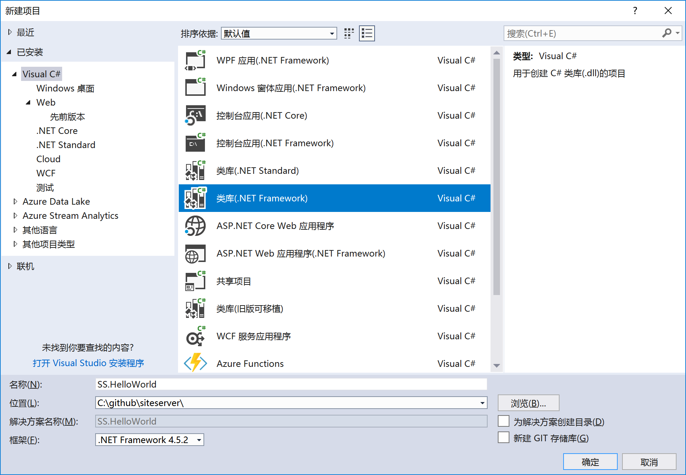
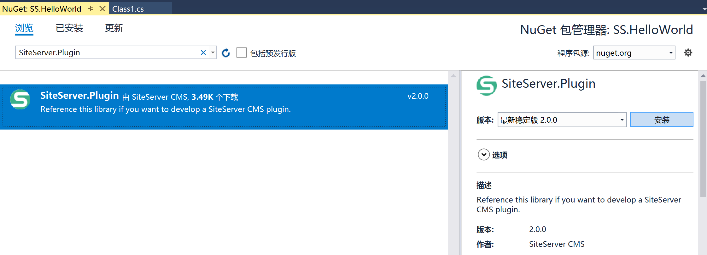
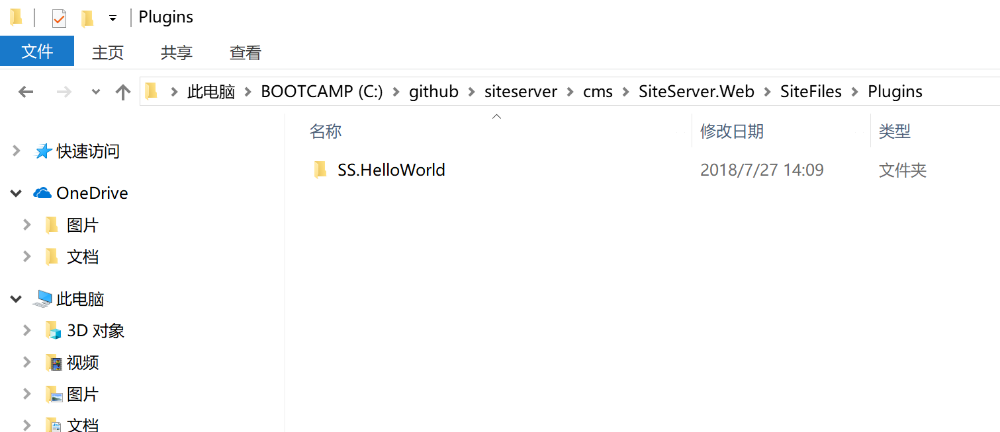
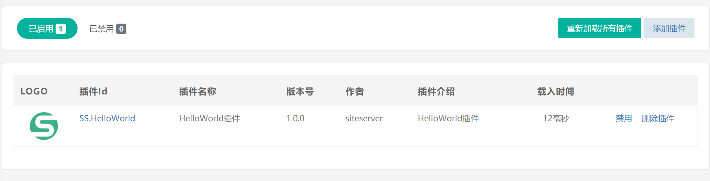
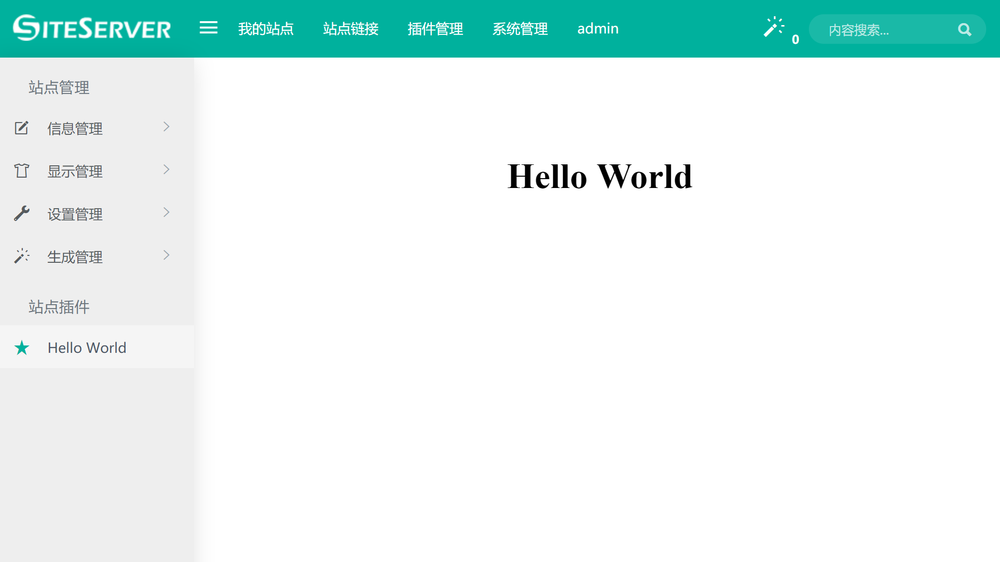

# 开发第一个插件

在此，我们将从零开始开发一个极简插件：Hello World。插件只实现一个功能：SiteServer CMS 后台显示插件菜单，点击进入页面显示Hello World。

## 1、使用Visual Studio 2017 创建项目与解决方案

首先，打开Visual Studio 2017，点击新建项目。



项目类型选择类库（.NET Framework），使用插件的Id作为项目名称，框架通常采用.NET Framework 4.5.2。

创建完毕项目后Visual Studio会自动生成Class1.cs。

## 2、安装NuGet包 SiteServer.Plugin

在 Visual Studio 中右键项目，在弹出菜单中选择 **管理 NuGet 程序包**，进入NuGet包管理界面。

在搜索框中输入 SiteServer.Plugin，获取到插件开发包，点击 **安装** 按钮。



安装完毕SiteServer.Plugin开发包，就可以开始实际编写插件了！

## 3、编写 Hello World 插件代码

将 Class1.cs改为Main.cs，输入代码：

```csharp
using SiteServer.Plugin;

namespace SS.HelloWorld
{
    public class Main : PluginBase
    {
        public override void Startup(IService service)
        {
            service.AddSiteMenu(siteId => new Menu
            {
                Text = "Hello World",
                Href = "index.html"
            });
        }
    }
}
```

这就完成了HelloWorld插件的代码编写，这段代码实现了一个插件类，继承了插件基类PluginBase，重写了插件Startup的方法，在插件载入时添加插件菜单，菜单链接到index.html页面中。

接下来在 Visual Studio 中创建index.html静态页面，输入代码：

```html
<!DOCTYPE html>
<html lang="en" xmlns="http://www.w3.org/1999/xhtml">
<head>
    <meta charset="utf-8" />
    <title></title>
</head>
<body>
    <h2 style="font-size: 36px;text-align: center;margin-top: 100px;">Hello World</h2>
</body>
</html>
```

接下来在 Visual Studio 中生成解决方案，将.cs文件编译为.dll程序包。

## 4、创建 Hello World 插件配置文件

每个插件都需要一个以 **插件Id.nuspec** 作为文件名的XML格式配置文件，用于设置此插件的名称、地址、许可协议等信息。

在 Visual Studio 中创建文件 SS.HelloWorld.nuspec，输入代码：

```xml
<?xml version="1.0"?>
<package>
  <metadata>
    <id>SS.HelloWorld</id>
    <version>1.0.0</version>
    <title>HelloWorld插件</title>
    <authors>SiteServer CMS</authors>
    <owners>siteserver</owners>
    <licenseUrl>https://github.com/siteserver/SS.HelloWorld/blob/master/LICENSE</licenseUrl>
    <projectUrl>https://github.com/siteserver/SS.HelloWorld</projectUrl>
    <iconUrl></iconUrl>
    <requireLicenseAcceptance>false</requireLicenseAcceptance>
    <releaseNotes></releaseNotes>
    <description>HelloWorld插件</description>
    <copyright>Copyright ©2018 SiteServer CMS</copyright>
    <tags>SiteServer CMS HelloWorld Plugin</tags>
  </metadata>
</package>
```

至此，HelloWorld 插件开发完毕，我们可以部署到实际环境中使用了！

## 5、部署插件

部署插件非常简单，只需要将整个文件夹拷贝至 SiteServer CMS 系统根目录下的 **SiteFiles/Plugins** 文件夹中即可：



将文件夹拷贝完成后，需要进入 SiteServer CMS 后台，在插件管理页面中点击 **重新加载所有插件**，之后就能在管理管理中查看此插件了：



同时，我们看到系统左侧出现了菜单 **Hello World**，点击后进入页面index.html，显示文字：



## 6、HelloWorld 代码下载

我们已经将HelloWorld 插件的代码托管在 Github上，请访问地址[https://github.com/siteserver/SS.HelloWorld](https://github.com/siteserver/SS.HelloWorld) 获取项目代码。